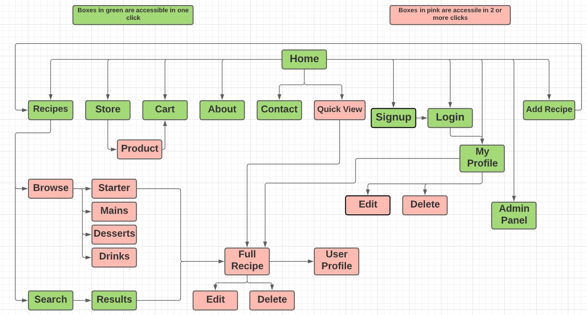

# Milestone Project Three

## Ripe Recipe

Welcome to Ripe Recipe, a recipes database with some social media crossovers. This project is packed full of features,
is fully responsive, and features both a recipes database, as well as a store for users to use.

As I always want to add new challenges for each project. This project has a scope that would be extremely difficult to 
create in "version 1" of this application. So the challenge with this project was to create a minimum viable product which 
prioritizes the basic functionality and will encompass as many features as possible, within a given schedule.

Further specific information on this project can be found below:

### Table of contents:
1. [Description](#Description),
2. [UX](#UX)
    1. [Logo](#Logo)
    2. [Wireframes](#Wireframes)
    3. [User Stories](#User-Stories) 
    4. [Information Architectures](#Information-Architectures)
    5. [Responsive Design](#Responsive-Design)
    6. [Frameworks](#Frameworks)
    7. [Typography](#Typography)
    8. [Colors](#Colors)
    9. [Icons](#Icons)
3. [Features](#Features)
    1. [Existing Features](#Existing-Features)
    2. [Future Features](#Future-Features)
4. [Technologies Used](#Technologies-Used)
5. [Testing](#Testing)
6. [Deployment](#Deployment)
    1. [Local Deployment](#Local-Deployment)
    2. [Remote Deployment](#Remote-Deployment)
7. [Credits](#Credits)
    1. [Media](#Media)
    2. [Content](#Content)
    3. [Acknowledgments](#Acknowledgments)

## **Description**
Ripe is a user focussed website that allows users to browse recipes and products. By signing up to Ripe, a user will gain access to discounts on products 
in the Ripe store and will also unlock several features such as leaving comments, having a personal profile, saving their favorite recipes, and more.

An admin panel is available to members with administrative privileges. This panel allows for unrestricted access to the database, as well as respond 
to "tickets" opened by users. 

### **The Ripe Concept**
The original plan for Ripe started with a simple website which would allow users to browse through a database of recipes.

Although this would be great for the user, the goals of the Ripe "management" is to sell products via an online store. 

The concept of Ripe started to mold into that of a crossover between a social media platform and a recipe database. This 
was down to the fact that social media platforms offer their users a service, and in return promote adverts. This is the concept 
that was chosen for this project.

With this model, a user of the website will come across adverts for the Ripe store. Non members may be inclined to sign up for the service due to discounts 
offered to Ripe members. 

As users sign up with an email, the future growth of Ripe could include email marketing. Saved recipes, as well as other data saved to user profiles, 
means that user specific "targetted advertising" and promotions could be expanded in the future.

---------------
## **UX**

This project aims to promote a mix of playful, yet professional dessign. A full breakdown on the 5 planes of UX are listed below. To enhance user experience 
the navigation of this website was considered in detail. Below is an image of the link structure with the amount of clicks necessary to access that page.

### 5 Planes of UX:
#### 1. Strategy:
> The strategy for this project is to produce a recipe database that users can browse and also promote products via an online store. 
> 
> Users will be able to browse recipes by category (starters, mains, desserts, or drinks).
>
> Users will be able to search for recipes.
>
> Users will be able to create a profile and edit that profile.
>
> Users will be able to communicate with other users.
>
> Users will be able to save recipes for future reference.

To expand further on strategy, I have included some user stories. They can be found in the [user stories](#User-Stories) section.

#### 2. Scope:

*Functional Requirements:*
> 1. A user must be capable of signing up to Ripe.
> 2. A user must be capable of editing and deleting their profile.
> 3. A user must be capable of adding a recipe to the database. 
> 4. A user must be able to communicate with other users.
> 5. A user must be able to leave comments on recipes.
> 6. A user must be able to add items to their basket.
> 7. A user must be able to view the items in their basket, and see a total price.
> 8. An admin must have unrestricted access to all data, with the exception of a users password.
> 9. An admin must be able to see, and reply to "tickets" to address any user needs.
> 10. An admin must be able to delete users and recipes.

*Content Requirements:*
> 1. Content must be relevant to specific recipes.
> 2. Recipes must have the option to show nutritional data.
> 3. Users must have a dashboard where they can see all of their information. (Profile page)

#### 3. Structure:
> * A standard navigation menu available across the entire website. With exceptions:
>   1. A user not logged in will see links that promote logging in or signing up.
>   2. A logged in user will see the full range of links available.
>   3. The homepage, whether logged in or not will provide a short list of key links to jump directly to a specific area of the website.
>
> * Each screen should provide a limited amount, but quality information to a user to decrease information overload and promote good UX.
>
> * All content should be contained in blocks that allow for distinction between certain areas. 

#### 4. Skeleton:
> As this project is centered around a recipe and product database, I decided to mold a website around a required database, rather than the 
> other way around.
>
> Key areas were defined for the operation of this website, these areas are:
>   1. Store.
>   2. Profile / User Pages.
>   3. Recipe Pages.
>   4. Admin Panel.
> 
> Initial wireframes were created, but through the evolution of this project, several designs have been changed, either due to designs not 
> fitting with the surrounding pages, or due to new features being added.
>
> You can view the wireframes for this project [here](#Wireframes)

#### 5. Surface:
> As this project is a user centric project, the surface plane was very important. Certain subtle additions have been added 
> in an attempt to promote good design. As some of the forms can be quite long, JavaScript was used to break down these forms 
> into small chunks, to make the process seem like an easier task. 
>
> Feedback via Python's Flash function provides users with specific positive feedback.

### <ins>**_Logo_**</ins>
The logo for this project is based simply on a photo that was available via [Pixabay](https://pixabay.com)

### <ins>**_Wireframes_**</ins>
You can view the wireframe designs [here](assets/readme/wireframes.pdf)

The wireframes for this project served as an initial design idea. As more features developed designs have been altered, or 
changed completely.

### <ins>**_User Stories_**</ins>

A full breakdown of user stories and the features created to address them are located in the [Full User Stories](user-stories-features.md) file. Below are the 
initial, 'founding' user stories.

Being a recipe database and store the following user stories specific to this project are: 

| **As the creator I want to:** |
| ------------------------------------------------------- |
|1. *Allow users view products.* |
|2. *Allow users to grow the recipe database.* |

| **As a user I want to:** |
| ------------------------------------------------------- |
|1. *Find recipes.* |
|2. *Browse for random recipes.* |
|3. *Save recipes for future reference.* |
|4. *Get discounts from the store.* |
|5. *Contact admins with issues.* |
|6. *Contact other users, or comment on recipes.* |

### <ins>**_Information Architectures_**</ins>
For this project, I wanted to use a design that meets UX design goals as well as functioning in a similar way to what 
users would expect. 

There really is 2 architectures at play in this project, that is for users that are members, and those who are not.

#### *Non Members:*
> A user who is not a member will be met by a landing page with a simple sign in, or sign up option as well as a third 
button which will give a brief explain what Ripe is. 
> Once inside the main structure of the website a non member will still have access to the full range of main navigation 
links, but the dropdown menu will only show login and signup links.

#### *Members:*
> A user who is a member (and has a browser cookie) will be met by a landing page with a few quick links to main sections within
the website.

### <ins>**_Responsive Design:_**</ins>
This project is fully responsive and has been tested on screen widths between 375px up to 3800px. For this, Materialize CSS 
was used throughout. - [Materialize.com](http://materializecss.com/)

### <ins>**_Typography_**</ins>
This project uses "Montez", and "Roboto" (Google Fonts).

### <ins>**_Colors_**</ins>
There are three primary colors used in this project:
1. rgb(245,41,135)
2. rgb(179,229,252)
3. rgb(234,128,252)

### <ins>**_Icons:_**</ins>
Icons are used throughout this website, and are used in an attempt to increase UX design where possible. Icons in use have been taken 
from [Font Awsome](http://fontawesome.com/)

--------------------
## **Features**

Due to the quantity of features available on this website, a video has been made to outline each page, and all features on those pages.

PLACE YOUTUBE LINK HERE

### <ins>**_Existing Features:_**</ins>

* Pagination
* Recipe Comments
* User Comments
* Adding / Deleting Users 
* Adding / Deleting Recipes 
* Adding / Deleting Items in Cart 
* Placeholder Checkout Form (No functionality at this time)
* Search Function (Via search bar)
* JavaScript Interactive Forms 
* User Feedback On Forms, Cart & Various Places Around Website
* Modals.
* Auto rotating advert.
* Ticketing system from users profile
* Messaging feature on users "chopping board" (similar to facebook wall feature)
* Comment on & rate recipes.
* Save recipes to your personal profile.
* Editing recipes (if you are the owner of that recipe)
* 404 Handling (for invalid URLs)

> **Visual Transitions**
Due to this website being a food application, the idea of enjoying the process of making the food was considered. Hence visually appealing 
transitions were used across the app to allow users enjoy their time browsing. Simply hiding and showing sections was too fast and didn't give 
the wanted feel to the website. Longer transitions on the other hand would be harmful to key factors such as bounce rate. With both sides in mind, I 
have tried to use timings that are fast enough, yet allow for the visual performance I wanted to achieve.

#### *Implemented but removed:*

Instant messenger:

An instant messenger feature was added but removed. Code is saved in txt file.

### <ins>**_Future Features:_**</ins>

A helper bot to help customers with product orders and store FAQ.

A custom shopping list based on saved recipes.

Automated email marketing. 

Functioning checkout form.

Non Member Cart 
    - As I have not covered Django yet. The entire store is currently set as a "Placeholder" and although users can browse through the store, its 
    functionality, such as adding and deleting items from their cart is available to members only. This sort of functionality will be added in my 
    next project with incorporates Django.
    
------------------
## **Technologies Used**

This project uses multiple languages, libraries and frameworks which can be found below:

### Languages
> 1. HTML5
>    1. HTML makes up the foundation of this project.
> 2. CSS3
>   1. CSS3 is used for all styling throught this application.
> 3. JavaScript
>   1. JavaScript is used for all interactive forms and is used to compliment Python code regarding forms.
> 4. Python
>   1. Python is the brains behind this project. All website routing as well as all database information is passed via a Python program.

### Frameworks, Libraries & Other
1. Gitpod
> GitPod was used to develop the project.
2. Git
> Git was used for version control to commit to Git and push to GitHub and Heroku.
3. GitHub
> GitHub is used to host the project files.
4. Google Fonts
> Google Fonts was used to provide the required fonts.
5. Balsamiqu
> Balsamiqu was used to create the mockup designs for the project.
6. Materialize
> Materialize was used for the design framework.
7. MobgoDB
> MongoDB is the fully managed cloud database that is used for this project.
8. Heroku
> Heroku is the cloud platform used for deploying this app online.
9. Flask
> Flask is the web framework used to provide libraries, tools and technologies for the app.
10. Jinja
> Jinja was used for templating Python
11. Werkzeug
> Werkzeug was used for password hashing in this project
12. jQuery
> jQuery was used throughout this project mainly to speed up programming.

---------------------
## **Testing**

This project has passed through several phases of testing, these phases include:

1. [W3 Validator](https://validator.w3.org/) to check all HTML. 
    1. To avoid issus and Flask, individual pages source code was added to validator in order to get valid feedback.

2. [W3 'Jigsaw' Validator](https://jigsaw.w3.org/css-validator/) to check all CSS.

3. [JS Hint](https://jshint.com/) to check all JavaScript. 

4. [PEP 8](http://pep8online.com/) to check all Python code.

5. [Autoprefixer](https://autoprefixer.github.io/) to ensure web browser compatability in CSS code.

> Testing was important in this project, with multiple forms located on pages. A recurring bug seemed to be the submission of multiple forms at once. To fix this problem 
jQuery was used to change a submit buttons value, this paired with an if statement in Python gave the desired outcome.

**Console.Log:** 

As forms use a change in value as part of a submission plan. Console log was used to ensure the correct outcome when clicking on submit buttons.

**Dev Tools:** 

As a means to testing visual problems, dev tools was used to identify and fix styling issues.
Dev tools was also used to improve features such as accessability, SEO, and performance where possible.

**Lighthouse:**

Lighthouse (Google Chrome Dev Tools) was used to find and fix performance, accessability, best practices and SEO issues. A sample lighthouse report can be found below:

**Responsive Design:**

To ensure responsive design I have used [Responsive Design](http://ami.responsivedesign.is/). This was used to compliment testing performed in Google dev tools.

### **Bugs & Issues**:

> Auto Submit Forms:
> On multiple occasions I came across a bug that was automatically submitting forms on page load.

* Fix: This problem was solved by using an if statement in Python, paired with a ".click()" function in jQuery. This means that 
on clicking submit a forms submit button will be given the value of "1". This will then satisfy the IF statement in Python and submit 
the form. 

> Updating a record was deleting all other fields. (MongoDB)

* Fix: One fix for this bug was to supply all of the previous information back into MongoDB. 

> Deleting item from cart would delete all items with matching descriptions.

* Fix: Generate a random string and attach this string to each list. Therefore even adding the same product twice will 
essentially create fields that can be differentiated between. This was chosen as a viable solution as I wanted to retain a nested list 
style within my database.

A full list of testing can be found in the [Testing](assets/readme/testing.md)

--------------------
## **Deployment**

### Requirements To Deploy:
- Python3
- Github account
- MongoDB account
- Heroku account

### Cloning This Project:
To create a clone, follow the following steps.

1. Log in to GitHub and go to the repository.
2. Click on the button with the text “Code”.
3. Click “Open with GitHub Desktop” and follow the prompts in the GitHub Desktop Application or follow the instructions from [GitHub](https://docs.github.com/en/free-pro-team@latest/github/creating-cloning-and-archiving-repositories/cloning-a-repository#cloning-a-repository-to-github-desktop) to see how to clone the repository in other ways.

#### To Work With Your Local Clone:
1. Install all the requirements: Go to the workspace of your local copy. In the terminal window of your IDE type: 
> pip3 install -r requirements.txt.
2. Create your database in MongoDB.
    1. Signup Or Login For [MongoDB](https://www.mongodb.com/)
    2. Create a cluster as well as a database.
    3. Create the following collections in the Database:
        1. comments
        2. messages
        3. products
        4. recipes
        5. tickets
        6. users
> Database Architectures Can Be Found [Here](/assets/readme/infoArc.md)
3. Create environment variables (env.py):
    1. Create a .gitignore file in the root directory of the project.
    2. Create a file in the root directory called "env.py". This will contain all of your envornment variables. Your env.py file should look similar to the following:
> Import os
>
> os.environ.setdefault("IP", "<IP TO USE>")
>
> os.environ.setdefault("PORT", "<PORT TO USE>")
>
> os.environ.setdefault("SECRET_KEY", "<ADD YOUR SECRET KEY>")
>
> os.environ.setdefault("MONGO_URI", "<ADD YOUR MONGO URI>")
>
> os.environ.setdefault("MONGO_DBNAME", "<ADD YOUR DATABASE NAME>")

    3. Add "env.py" to your .gitignore file.
    4. Finally to run the app, open a terminal and type "python3 app.py" and run the application.

### Deploying To Heroku

To deploy our application on Heroku, we are required to have a requirements.txt file as well as a Procfile. These files will allow Heroku understand 
what dependencies are required to run the application, as well as tell Heroku which file to run, to launch the application.

#### Create a procfile:
> Type "python app.py > Procfile"
**This new file if opened should look something like "web: python app.py"**
#### Create a requirements file:
> Type "pip freeze --local > requirements.txt"
**This new file should simply be a list of all dependencies required**

#### For Deployment:
1. Open [Heroku](http://heroku.com/).
2. Login or signup for Heroku.
3. Once logged in create a new app and select the desired region. 
4. Deployment method "GitHub" (if this section is accidentally missed, you can use the tab selection within your dashboard "DEPLOY")
5. Select "connect to GitHub" and follow the on screen instructions. Once connected to your Github:
    1. Search for your repository using the form provided.
6. Once you have connected your GitHub repository:
    1. Navigate to the "Settings" tab:
        1. Scroll to the section "Config Vars" here you will have to tell Heroku what these variables are:
            1. Input data from env.py in the key value section:

> E.g. Key: "IP", Value: "<IP YOU HAVE IN ENV.PY>"

            2. Input all data for IP, PORT, SECRET_KEY, MONGO_DBNAME & MONGO_URI
    2. Navigate back to the "Deploy" tab:
        1. Scroll to the "Manual Deploy" tab:
            1. Select the branch you wish to deploy (master is default)
            2. Click the "Deploy Branch" button. (This may take some time as Heroku uploads the app to their servers.) 

*Once the build is complete, a "View App" button will appear just below the build progress box. You can click this to see immediately if the build was successful. If the app doesn't load first time, try refresh once prior to investigating further.*
*Common issues include outdated requirements.txt and/or missing Procfile, if errors occur, check these are both correct*
----------------------
## **Credits**
This project, although pieced together by myself, incorporates images, video, sound, and code from multiple sources. These include:
    

### <ins>**_Media:_**</ins>
1. Smoke - [Pixabay Stock & Royalty Free Image](https://pixabay.com/photos/abstract-smoke-background-swirl-69124/)
2. Fire - [Pixabay Stock & Royalty Free Image](https://pixabay.com/photos/flames-black-red-yellow-fire-1645399/)
3. Logo - [Pixabay Stock & Royalty Free Image](https://pixabay.com/vectors/chef-cook-wink-perfect-uniform-29205/)
4. Recipe Photos - Recipes added by admin originate from BBC good food and can be found by searching for the name of recipe.
5. Wood - [Pixabay Stock & Royalty Free Image](https://pixabay.com/photos/wood-floor-backdrop-background-1866667/)
6. Starters Card: [Pixabay Stock & Royalty Free Image](https://pixabay.com/photos/dakos-tomato-olives-olive-oil-3538425/)
7. Main Card: [Pixabay Stock & Royalty Free Image](https://pixabay.com/photos/fry-up-paella-pan-frying-pan-fry-285360/)
8. Desserts Card: [Pixabay Stock & Royalty Free Image](https://pixabay.com/photos/cupcakes-dessert-frosting-food-690040/)
9. Drinks Card: [Pixabay Stock & Royalty Free Image](https://pixabay.com/photos/bar-beverage-cocktail-drink-glass-1839361/)

### <ins>**_Content:_**</ins>
> All text content is my own, with the exception of recipes added by "Admin" and product descriptions which originate from 
both BBC Good Food, and Amazon. Recipes have not been altered from their original, to see original versions, please copy a 
recipe name, and search on BBC good food for the original copies.

### <ins>**Code:**</ins>
> Pagination code prior to editing was posted on [Stack Overflow](https://stackoverflow.com/questions/6726896/how-to-make-jquery-pagination)
>
> Card "flip" used on recipe pages originally from W3Schools prior to editing.

*I have used W3 Schools and StackOverflow when I did not achieve a result, these specific codes are referenced within pages and / or scripts through notation.*

### <ins>**_Acknowledgments:_**</ins>
I would like to acknowledge my mentor <ins>Caleb Mbakwe</ins> for his guidance and tips during this project.

## *Previews:*
Here are a few previews of Ripe Recipes (mockups from [Am I Responsive](http://ami.responsivedesign.is/))

### Landing Page 

### Recipe Page

### Search Page With Results

### Store Page

### Cart Page

